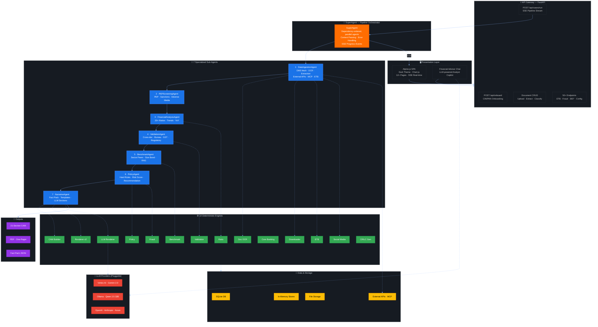

# Architecture Process Document

> CAM Intelligence Platform — System Architecture, Data Flow & Process Design

---

## Architecture Diagrams

### Diagram 1 — Agentic Pipeline Overview (Compact)

```mermaid
%%{init: {'theme': 'dark', 'themeVariables': {'primaryColor': '#1a73e8', 'primaryTextColor': '#fff', 'lineColor': '#8ab4f8', 'background': '#0d1117', 'mainBkg': '#161b22', 'nodeBorder': '#30363d', 'clusterBkg': '#13171e', 'clusterBorder': '#30363d'}}}%%
graph LR
    subgraph FRONTEND["Frontend"]
        UI["Alpine.js SPA"]
        CHAT["Analyst Chat"]
    end

    subgraph API["FastAPI · 50+ Endpoints"]
        GW["API Gateway"]
    end

    subgraph PIPELINE["SuperAgent Pipeline"]
        direction TB
        A1["1 · Data Ingestion"]
        A2["2 · PEP Screening"]
        A3["3 · Financial Analysis"]
        A4["4 · Validation"]
        A5["5 · Benchmarking"]
        A6["6 · Policy & Risk"]
        A7["7 · Narrative"]
        A1 --> A2 --> A3 --> A4 --> A5 --> A6 --> A7
    end

    subgraph ENGINES["14 Engines"]
        direction TB
        EG1["Ratio · Benchmark · Validation"]
        EG2["Policy · Fraud · ETB Analytics"]
        EG3["CAM Builder · Renderer · LLM Renderer"]
        EG4["OCR · Downloader · CRILC · Social · Banking"]
    end

    subgraph LLM["LLM Providers"]
        direction TB
        L1["Gemini 2.0 Flash"]
        L2["Ollama · OpenAI · Anthropic"]
    end

    subgraph DATA["Data Layer"]
        direction TB
        D1["SQLite DB"]
        D2["File Storage"]
        D3["External APIs · MCP"]
    end

    subgraph OUT["Output"]
        direction TB
        O1["21-Section CAM"]
        O2["PDF · One-Pager · Fact Pack"]
    end

    UI --> GW
    CHAT --> GW
    GW --> A1
    PIPELINE -.-> ENGINES
    ENGINES -.-> DATA
    A7 -.-> LLM
    CHAT -.-> LLM
    A7 --> O1
    O1 --> O2
    GW -->|SSE| UI

    classDef agent fill:#1a73e8,stroke:#4285f4,color:#fff
    classDef engine fill:#34a853,stroke:#0d904f,color:#fff
    classDef llm fill:#ea4335,stroke:#d93025,color:#fff
    classDef data fill:#fbbc04,stroke:#f29900,color:#000
    classDef output fill:#9334e6,stroke:#7627bb,color:#fff

    class A1,A2,A3,A4,A5,A6,A7 agent
    class EG1,EG2,EG3,EG4 engine
    class L1,L2 llm
    class D1,D2,D3 data
    class O1,O2 output
```



### Diagram 2 — Enterprise Agentic Architecture (MCP · ML · External Integration)

```mermaid
%%{init: {'theme': 'dark', 'themeVariables': {'primaryColor': '#1a73e8', 'primaryTextColor': '#e8eaed', 'lineColor': '#8ab4f8', 'background': '#0d1117', 'mainBkg': '#161b22', 'nodeBorder': '#30363d', 'clusterBkg': '#0d1117', 'clusterBorder': '#30363d', 'fontSize': '13px'}}}%%
graph TB

    subgraph ENTRY["🏦 Enterprise Entry Points"]
        direction LR
        RM["Relationship Manager<br/>Web Portal"]
        CREDIT["Credit Analyst<br/>Review Interface"]
        SYSTEM["Upstream Systems<br/>Core Banking / LOS"]
    end

    subgraph ORCHESTRATION["🧠 Agentic Orchestration Layer"]
        direction TB
        SA["<b>SuperAgent Orchestrator</b><br/>Dependency-ordered parallel agents · Context Chain<br/>SSE Streaming · Fault Tolerance"]
        
        subgraph AGENT_POOL["Autonomous Agent Pool"]
            direction LR
            AG1["DataIngestion<br/>Agent"]
            AG2["PEP/AML<br/>Agent"]
            AG3["Financial<br/>Analysis Agent"]
            AG4["Validation<br/>Agent"]
            AG5["Benchmark<br/>Agent"]
            AG6["Policy &<br/>Risk Agent"]
            AG7["Narrative<br/>Agent"]
        end

        SA --> AG1
        SA --> AG2
        SA --> AG3
        SA --> AG4
        SA --> AG5
        SA --> AG6
        SA --> AG7
    end

    subgraph MCP_LAYER["🔌 MCP Integration Layer — Model Context Protocol"]
        direction LR
        MCP_CLIENT["<b>MCP Client</b><br/>Session Init · tools/list<br/>tools/call · SSE Parsing"]
        
        subgraph MCP_TOOLS["MCP Tool Registry"]
            direction TB
            T1["company_lookup"]
            T2["director_search"]
            T3["financial_fetch"]
            T4["compliance_check"]
            T5["charges_register"]
            T6["gstin_profile"]
        end

        MCP_CLIENT --> MCP_TOOLS
    end

    subgraph EXTERNAL["🌐 External Data Ecosystem"]
        direction TB
        
        subgraph GOV_API["Government & Regulatory"]
            direction LR
            MCA["MCA V3<br/>Company Master"]
            GST["GSTN<br/>GST Profile"]
            RBI["RBI CRILC<br/>Fund/Non-Fund"]
            EPFO["EPFO<br/>Compliance"]
        end

        subgraph MARKET_API["Market & Intelligence"]
            direction LR
            NSE["NSE/BSE<br/>Filings & Prices"]
            RATING["CRISIL · CARE<br/>ICRA · Fitch"]
            NEWS["News &<br/>Sentiment"]
            SOCIAL["Social Media<br/>& ESG Signals"]
        end

        subgraph BUREAU_API["Credit Bureau"]
            direction LR
            CIBIL["CIBIL<br/>Commercial"]
            EQUIFAX["Equifax<br/>Business"]
            EXPERIAN["Experian<br/>Corporate"]
        end
    end

    subgraph ML_AI["🤖 ML & AI Engine Layer"]
        direction TB

        subgraph LLM_PROVIDERS["LLM Providers — Pluggable"]
            direction LR
            GEMINI["Google Vertex AI<br/><b>Gemini 2.0 Flash</b>"]
            OLLAMA["Ollama Local<br/><b>Qwen 2.5 32B</b>"]
            GPT["OpenAI / Azure<br/><b>GPT-4</b>"]
            CLAUDE["Anthropic<br/><b>Claude</b>"]
        end

        subgraph ML_ENGINES["Deterministic ML & Rule Engines"]
            direction LR
            RATIO["Ratio Engine<br/>20+ Metrics"]
            FRAUD["Fraud Detection<br/>Multi-Signal"]
            RISK["Risk Scoring<br/>Composite 0-100"]
            BENCH["Benchmark<br/>Sector RAG"]
        end

        subgraph AI_SERVICES["AI-Powered Services"]
            direction LR
            OCR["Document OCR<br/>PyMuPDF + Gemini Vision"]
            NLP["Financial NLP<br/>Entity Extraction"]
            NARRATIVE["CAM Narrative<br/>14 LLM Sections"]
            COPILOT["Analyst Copilot<br/>Context-Aware Chat"]
        end
    end

    subgraph PERSISTENCE["💾 Enterprise Data Layer"]
        direction LR
        SQLITE["SQLite<br/>Companies · Cases<br/>Comments · Users"]
        INMEM["In-Memory Cache<br/>Hot Stores<br/>company · case · etb"]
        DMS["Document Store<br/>13 Categories<br/>Per Entity"]
        GCS["GCS Bucket<br/>Cloud Storage FUSE<br/>Persistent Runtime"]
    end

    subgraph OUTPUT["📊 Enterprise Outputs"]
        direction LR
        CAM["21-Section CAM<br/>Markdown + PDF"]
        FACTPACK["Fact Pack JSON<br/>38 Auditable Keys"]
        ONEPAGER["Executive<br/>One-Pager"]
        AUDIT["Full Audit Trail<br/>Data Lineage"]
    end

    ENTRY --> ORCHESTRATION
    AG1 --> MCP_LAYER
    MCP_LAYER --> EXTERNAL
    AG1 -.->|"Direct API"| EXTERNAL
    AG2 -.-> ML_AI
    AG3 --> ML_ENGINES
    AG4 --> ML_ENGINES
    AG5 --> ML_ENGINES
    AG6 --> ML_ENGINES
    AG7 --> LLM_PROVIDERS
    AG7 --> AI_SERVICES
    COPILOT -.-> LLM_PROVIDERS
    OCR -.-> GEMINI
    NARRATIVE -.-> LLM_PROVIDERS
    ML_AI -.-> PERSISTENCE
    ORCHESTRATION -.-> PERSISTENCE
    AG7 --> OUTPUT
    SA -.->|"SSE Events"| ENTRY

    classDef orchestrator fill:#ff6d01,stroke:#e65100,color:#fff,stroke-width:2px
    classDef agent fill:#1a73e8,stroke:#4285f4,color:#fff,stroke-width:2px
    classDef mcp fill:#00bcd4,stroke:#0097a7,color:#fff,stroke-width:2px
    classDef external fill:#78909c,stroke:#546e7a,color:#fff,stroke-width:1px
    classDef ml fill:#ea4335,stroke:#d93025,color:#fff,stroke-width:1px
    classDef engine fill:#34a853,stroke:#0d904f,color:#fff,stroke-width:1px
    classDef ai fill:#ab47bc,stroke:#8e24aa,color:#fff,stroke-width:1px
    classDef data fill:#fbbc04,stroke:#f29900,color:#000,stroke-width:1px
    classDef output fill:#9334e6,stroke:#7627bb,color:#fff,stroke-width:1px
    classDef entry fill:#37474f,stroke:#263238,color:#fff,stroke-width:1px

    class SA orchestrator
    class AG1,AG2,AG3,AG4,AG5,AG6,AG7 agent
    class MCP_CLIENT,T1,T2,T3,T4,T5,T6 mcp
    class MCA,GST,RBI,EPFO,NSE,RATING,NEWS,SOCIAL,CIBIL,EQUIFAX,EXPERIAN external
    class GEMINI,OLLAMA,GPT,CLAUDE ml
    class RATIO,FRAUD,RISK,BENCH engine
    class OCR,NLP,NARRATIVE,COPILOT ai
    class SQLITE,INMEM,DMS,GCS data
    class CAM,FACTPACK,ONEPAGER,AUDIT output
    class RM,CREDIT,SYSTEM entry
```



### Diagram 3 — Detailed Agent-Engine Mapping



---

## 1. System Architecture Overview

The CAM Intelligence Platform follows a **layered architecture** with clear separation between data ingestion, analytical processing, AI orchestration, and presentation.

```
┌─────────────────────────────────────────────────────────────────┐
│                        FRONTEND LAYER                           │
│              Alpine.js SPA + Chart.js Visualizations            │
│         (Dark theme, SSE real-time updates, 12+ pages)          │
└──────────────────────────┬──────────────────────────────────────┘
                           │ REST API + SSE
┌──────────────────────────▼──────────────────────────────────────┐
│                        API LAYER (FastAPI)                       │
│    50+ endpoints: Companies, Cases, Pipeline, Documents,         │
│    Extraction, ETB, Chat, Fraud, 360°, Config, LLM              │
└──────────────────────────┬──────────────────────────────────────┘
                           │
┌──────────────────────────▼──────────────────────────────────────┐
│                   ORCHESTRATION LAYER                            │
│    SuperAgent → 7 Sub-Agents, started as dependencies finish:   │
│    DataIngestion ∥ PEPScreening → FinancialAnalysis ∥ Validation│
│    → Benchmark → Policy → Narrative (sections ∥ on hosted LLMs) │
└──────────────────────────┬──────────────────────────────────────┘
                           │
┌──────────────────────────▼──────────────────────────────────────┐
│                      ENGINE LAYER (14 Engines)                   │
│  ┌──────────┐ ┌───────────┐ ┌────────────┐ ┌───────────────┐   │
│  │  Ratio   │ │ Benchmark │ │ Validation │ │    Policy      │   │
│  │  Engine  │ │  Engine   │ │   Engine   │ │    Engine      │   │
│  └──────────┘ └───────────┘ └────────────┘ └───────────────┘   │
│  ┌──────────┐ ┌───────────┐ ┌────────────┐ ┌───────────────┐   │
│  │  Fraud   │ │    ETB    │ │    CAM     │ │  CAM LLM      │   │
│  │ Detection│ │ Analytics │ │ Fact Build │ │  Renderer      │   │
│  └──────────┘ └───────────┘ └────────────┘ └───────────────┘   │
│  ┌──────────┐ ┌───────────┐ ┌────────────┐ ┌───────────────┐   │
│  │  Core    │ │  Social   │ │  Document  │ │   CRILC       │   │
│  │ Banking  │ │   Media   │ │  Downloader│ │  Report Gen   │   │
│  └──────────┘ └───────────┘ └────────────┘ └───────────────┘   │
│  ┌──────────┐ ┌───────────┐                                     │
│  │ Document │ │ CAM One   │                                     │
│  │   OCR    │ │  Pager    │                                     │
│  └──────────┘ └───────────┘                                     │
└──────────────────────────┬──────────────────────────────────────┘
                           │
┌──────────────────────────▼──────────────────────────────────────┐
│                      DATA LAYER                                  │
│  ┌──────────┐ ┌───────────┐ ┌────────────┐ ┌───────────────┐   │
│  │  SQLite  │ │ In-Memory │ │   File     │ │  External     │   │
│  │   DB     │ │  Stores   │ │  Storage   │ │    APIs       │   │
│  └──────────┘ └───────────┘ └────────────┘ └───────────────┘   │
└─────────────────────────────────────────────────────────────────┘
```

## 2. Core Design Principles

### 2.1 Deterministic-First Architecture

The platform prioritizes **deterministic processing** over AI inference:

- All financial ratios, benchmarks, policy checks, and risk scores are computed by rule-based engines
- LLM is used **only** for narrative commentary — never for number crunching
- Same input always produces the same analytical output
- LLM sections are clearly marked and separated from computed sections

### 2.2 Canonical Data Model

All company data flows through a **single canonical model** (`src/models/canonical_model.py`):

```
Borrower           — Company identity (CIN, PAN, sector, listing status)
GroupEntity         — Corporate group structure
DirectorPromoter   — Board members and promoters
FinancialStatement — Standardized P&L, Balance Sheet, Cash Flow
FacilityRequest    — Credit facility being requested
ExistingExposure   — Current banking relationships
Collateral         — Security offered
MarketSignal       — Market intelligence and news
ConductRecord      — ETB account behavior (DPD, utilization)
CovenantRecord     — ETB covenant compliance
```

### 2.3 Pluggable LLM Architecture

The platform supports multiple LLM providers through a provider abstraction:

| Provider | Model | Use Case |
|----------|-------|----------|
| Google Vertex AI | Gemini 2.0 Flash | Production (Cloud Run) |
| Ollama | Qwen 2.5 32B | Local development |
| OpenAI | GPT-4 | Alternative cloud |
| Anthropic | Claude | Alternative cloud |
| Azure OpenAI | GPT-4 | Enterprise |
| Mock | Template-based | Testing (no LLM needed) |

## 3. Data Flow Process

### 3.1 Company Onboarding Flow

```
User enters CIN/PAN
        │
        ▼
POST /api/onboard
        │
        ▼
┌─────────────────────────┐
│  Company Onboarding     │
│  Service                │
│  ┌───────────────────┐  │
│  │ 1. MCA Lookup     │──── Fetch company master from MCA
│  │ 2. GSTIN Fetch    │──── Fetch GST profile
│  │ 3. Bureau Pull    │──── Fetch credit bureau data
│  │ 4. Rating Fetch   │──── Fetch credit ratings
│  │ 5. Market Intel   │──── Fetch news & market data
│  │ 6. NSE/BSE Data   │──── Fetch exchange filings
│  │ 7. CRILC Pull     │──── Fetch RBI CRILC data
│  └───────────────────┘  │
└────────────┬────────────┘
             │
             ▼
    Canonical Model Created
    Documents Stored in storage/documents/{entity_id}/
    Company registered in SQLite DB
```

### 3.2 CAM Pipeline Flow (SuperAgent Orchestration)

```
POST /api/cases/{id}/run
        │
        ▼
┌──────────────────────────────────────────────┐
│              SUPER AGENT PIPELINE            │
│                                              │
│  Stage 1: DataGatherAgent                    │
│  ├── Load company data from store            │
│  ├── Fetch external data (bureau, MCA, GST)  │
│  └── Assemble raw data package               │
│                                              │
│  Stage 2: ExtractionAgent                    │
│  ├── Parse uploaded documents (PDF/XLSX)     │
│  ├── OCR processing (PyMuPDF + Gemini)       │
│  └── Extract financial data & metadata       │
│                                              │
│  Stage 3: AnalysisAgent                      │
│  ├── Ratio Engine (20+ financial ratios)     │
│  ├── Benchmark Engine (sector comparison)    │
│  ├── ETB Analytics (if existing customer)    │
│  ├── Fraud Detection Engine                  │
│  └── PEP/Sanctions Screening                 │
│                                              │
│  Stage 4: ValidationAgent                    │
│  ├── Cross-document validation               │
│  ├── Regulatory compliance checks            │
│  └── Data quality scoring                    │
│                                              │
│  Stage 5: PolicyAgent                        │
│  ├── Credit policy rule evaluation           │
│  ├── Exposure limit checks                   │
│  └── Risk grade computation                  │
│                                              │
│  Stage 6: NarrativeAgent                     │
│  ├── Build CAM fact pack (38 keys)           │
│  ├── Render template sections                │
│  └── Generate LLM narrative (14 sections)    │
│                                              │
│  Stage 7: FinalAgent                         │
│  ├── Assemble complete CAM                   │
│  ├── Generate one-pager                      │
│  └── Persist to database                     │
└──────────────────────────────────────────────┘
        │
        ▼
    SSE events → Frontend (real-time progress)
    CAM stored in case_runs table
    PDF/Markdown available for download
```

### 3.3 CAM Fact Pack Assembly

The CAM fact pack is the central data structure assembled by `cam_fact_builder.py`:

```
Fact Pack (38 keys)
├── cover_data          — Company name, CIN, date, analyst
├── borrower_profile    — Sector, incorporation, promoters, group
├── industry_analysis   — Revenue segments, geo mix, SWOT
├── facility_details    — Requested amount, type, tenor, purpose
├── financial_summary   — 3-year P&L, BS, CF with YoY trends
├── ratio_analysis      — 20+ computed ratios with RAG status
├── benchmark_results   — Sector peer comparison
├── collateral_details  — Security valuation, coverage ratio
├── conduct_summary     — ETB behavior (DPD, utilization, SMA)
├── compliance_checks   — 6-7 regulatory compliance items
├── quarterly_performance — Q1-Q4 with seasonal weighting
├── validation_results  — Cross-document validation findings
├── policy_decisions    — Rule evaluation results
├── risk_assessment     — Composite score, grade, recommendation
├── fraud_indicators    — Fraud detection signals
├── pep_screening       — PEP/sanctions/adverse media results
├── market_intelligence — News sentiment, stock signals
├── external_ratings    — Agency ratings with outlook
├── site_visit_data     — (Optional) site visit findings
├── valuation_data      — (Optional) valuation assessment
├── bank_statement_data — (Optional) bank statement analysis
└── audit_trail         — Data lineage & processing log
```

### 3.4 CAM Rendering Process

```
Fact Pack JSON
      │
      ├──► Template Renderer (cam_renderer_v2.py)
      │    └── 7 template sections (cover, TOC, financials, tables)
      │
      ├──► LLM Renderer (cam_llm_renderer.py)
      │    └── 14 AI narrative sections
      │    └── Per-section prompts: CAM_SECTIONS (cam_llm_renderer.py)
      │    └── Context injection from fact pack
      │
      └──► Combined Markdown CAM (21 sections total)
           ├── Section 1:  Cover Page
           ├── Section 2:  Table of Contents
           ├── Section 3:  Executive Summary (LLM)
           ├── Section 4:  Borrower Profile (LLM)
           ├── Section 5:  Industry Analysis (LLM)
           ├── Section 6:  Facility Details
           ├── Section 7:  Financial Analysis (LLM + Tables)
           ├── Section 8:  Benchmark Comparison (LLM)
           ├── Section 9:  Collateral Assessment (LLM)
           ├── Section 10: Account Conduct (LLM — ETB only)
           ├── Section 11: Compliance & Regulatory
           ├── Section 12: Infrastructure Assessment (LLM)
           ├── Section 13: External Intelligence (LLM)
           ├── Section 14: Fraud & PEP Screening (LLM)
           ├── Section 15: Key Risks & Mitigants (LLM)
           ├── Section 16: Validation Summary
           ├── Section 17: Policy Assessment
           ├── Section 18: Risk Assessment & Scoring
           ├── Section 19: Recommendation (LLM)
           ├── Section 20: Annexures (Tables)
           └── Section 21: Audit Trail
```

## 4. Engine Details

### 4.1 Ratio Engine

Computes 20+ financial ratios from canonical `FinancialStatement` line items:

| Category | Ratios |
|----------|--------|
| Profitability | EBITDA Margin, PAT Margin, ROE, ROCE, ROA |
| Leverage | Debt-to-Equity, Debt/EBITDA, Interest Coverage (ICR) |
| Liquidity | Current Ratio, Quick Ratio, Cash Ratio |
| Efficiency | Asset Turnover, Inventory Turnover, Receivable Days |
| Cash Flow | Operating CF/Revenue, Free Cash Flow, DSCR |
| Growth | Revenue Growth YoY, EBITDA Growth, PAT Growth |

### 4.2 Benchmark Engine

Compares computed ratios against sector-specific thresholds from `config/benchmarks.yaml`:

- **Sector benchmarks** — Industry-specific thresholds (manufacturing, IT, pharma, etc.)
- **Size band comparison** — Large cap vs mid cap vs small cap
- **Rating bucket comparison** — AAA vs AA vs A vs BBB
- **RAG classification** — Green/Amber/Red for each metric

### 4.3 Policy Engine

Evaluates credit policy rules from `config/rules.yaml`:

- Exposure limits (single borrower, group, sector)
- Minimum financial thresholds (ICR, DSCR, leverage)
- Rating-based eligibility
- NPA/SMA status checks
- Regulatory hold checks

### 4.4 Fraud Detection Engine

Analyzes multiple signals for fraud/governance concerns:

- Director disqualification checks
- Circular trading patterns
- Revenue-employee mismatch
- GST turnover vs declared revenue mismatch
- PEP/sanctions database screening
- Adverse media scanning
- Related party transaction analysis

### 4.5 ETB Analytics Engine

For existing bank customers, analyzes transactional behavior:

- Account utilization patterns
- DPD (Days Past Due) frequency
- SMA (Special Mention Account) status
- Covenant compliance tracking
- Conduct score computation

## 5. External Data Integration

### 5.1 Data Sources

| Source | Data Retrieved | Protocol |
|--------|---------------|----------|
| MCA (Ministry of Corporate Affairs) | Company master, directors, charges | REST API |
| GSTIN | GST profile, turnover, filing compliance | REST API |
| Credit Bureau | Credit score, DPD, facility list | REST API |
| CRILC (RBI) | Fund/non-fund facility aggregation | REST API |
| NSE/BSE | Filings, financial results, corporate actions | REST API |
| Credit Rating Agencies | Ratings, outlook, history | REST API |
| EPFO | Employee count, compliance | REST API |
| Market Intelligence | News, sentiment, legal proceedings | REST API |

### 5.2 Integration Pattern

All external data follows a standardized envelope:

```json
{
  "source": "bureau_commercial",
  "record_type": "COMMERCIAL_BUREAU_REPORT",
  "entity_key": "AABCB1234F",
  "as_of_date": "2026-03-13",
  "payload_version": "2.0",
  "source_status": "valid",
  "payload": { ... }
}
```

## 6. Deployment Architecture

### 6.1 Local Development

```
┌─────────────┐    ┌──────────────┐
│  Browser     │───▶│  FastAPI      │
│  :8001       │    │  (uvicorn)   │
└─────────────┘    │              │
                   │  SQLite DB   │
                   │  File Storage│
                   │  Ollama LLM  │
                   └──────────────┘
```

### 6.2 Google Cloud Run (Production)

```
┌─────────────┐    ┌──────────────────────────────┐
│  Browser     │───▶│  Cloud Run Service            │
│              │    │  (Docker container)            │
└─────────────┘    │                                │
                   │  ┌──────────────────────────┐  │
                   │  │ FastAPI + Alpine.js SPA   │  │
                   │  └──────────────────────────┘  │
                   │                                │
                   │  ┌──────────────────────────┐  │
                   │  │ GCS FUSE Volume           │  │
                   │  │ /app/runtime-db           │  │
                   │  │ (SQLite + persistent data)│  │
                   │  └──────────────────────────┘  │
                   │                                │
                   │  ┌──────────────────────────┐  │
                   │  │ Vertex AI (Gemini 2.0)    │  │
                   │  │ ADC authentication        │  │
                   │  └──────────────────────────┘  │
                   └──────────────────────────────┘
```

### 6.3 Docker Compose

```yaml
services:
  cam:        # Main application (port 8000)
  mock:       # External API mock server
```

## 7. Security Considerations

- **No hardcoded credentials** — All secrets via environment variables
- **Input validation** — FastAPI Pydantic models for all endpoints
- **CORS** — Configurable origin whitelist
- **Authentication** — SQLite RBAC framework (ready for production auth)
- **LLM safety** — System prompts prevent prompt injection in CAM generation
- **Data isolation** — Per-entity document storage with entity ID scoping
