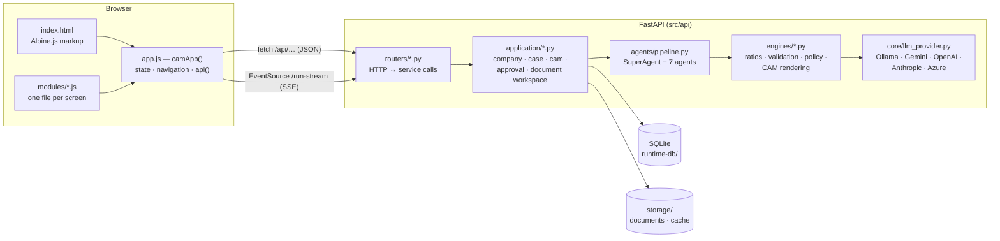
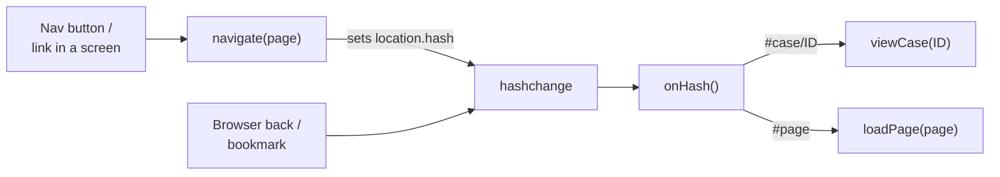
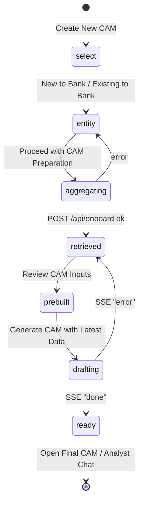
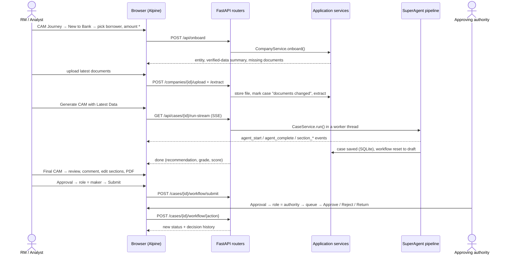
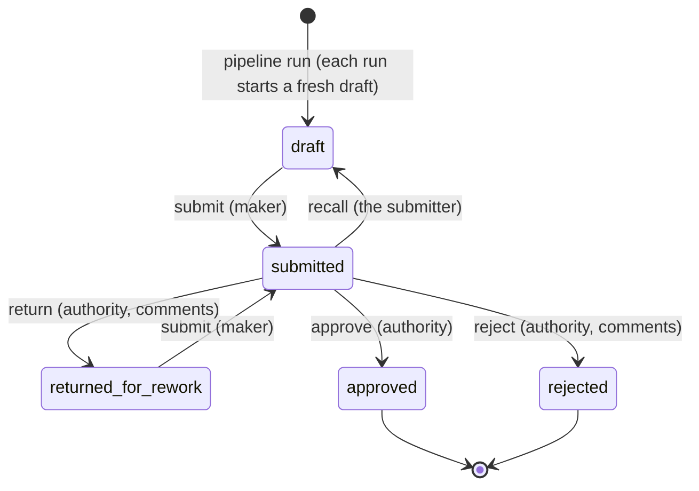

# Frontend ↔ Backend Integration

How each screen of the CAM Intelligence Platform is wired to the backend: what the screen
is for, which control calls which endpoint, which service does the work, and how the
screens connect into the end-to-end credit flow.

Read alongside:
- [README](../README.md) — setup, configuration, pipeline execution
- [Architecture Reference](ARCHITECTURE_REFERENCE.md) — engines, agents, data model
- [User Manual](../documents/USER_MANUAL.md) — step-by-step operator guide

---

## 1. How the pieces fit

| Layer | Location | Responsibility |
|---|---|---|
| Markup | `src/ui/templates/index.html` | All screens in one page; `x-show` picks the visible one |
| Core | `src/ui/static/js/app.js` | Shared state, start-up, navigation, `api()` helper, company/case lists |
| Screen modules | `src/ui/static/js/modules/` | `dashboard`, `journey`, `documents`, `pipeline`, `case-detail`, `reports`, `approvals`, `settings`, plus `formatters` (no API calls) |
| Routers | `src/api/routers/` | One per area; translate HTTP to service calls, no business logic |
| Services | `src/application/` | Own state and orchestration; raise `ApplicationError` → HTTP status |
| Pipeline | `src/agents/` | Agents run in dependency order (independent ones in parallel) |
| Engines | `src/engines/` | Deterministic credit logic and CAM rendering |

The modules are plain functions returning methods; `camApp()` merges them into **one** Alpine
component, so `this` inside any module is the whole app (shared state, `this.api()`, other
screens' methods). The page loads the modules before `app.js`.

---

## 2. Frontend mechanics every screen relies on

### 2.1 Calling the backend — `api(path, opts, { quiet })`

- Prefixes `/api/`, parses JSON, and on a non-2xx response throws with the server's
  `detail` message **and shows it as an error toast**.
- `quiet: true` suppresses the toast for lookups where a 404 just means "not run yet"
  (stored fraud scan, ETB analytics).
- File uploads (`multipart/form-data`) and the SSE stream use `fetch` / `EventSource`
  directly; PDFs and HTML renditions open in a new tab with `window.open`.

### 2.2 Navigation and page loading

- The URL hash is the single trigger for loading a screen's data, so a page loads once per
  visit. Clicking the page you are already on refreshes it.
- **Company and case lists** (`GET /api/companies`, `GET /api/cases`) are shared by most
  screens. While navigating they are reused if fetched in the last 10 s (`NAV_CACHE_MS`);
  actions that change data (runs, uploads, onboarding, manual add) reload them directly.
- **Start-up** (`init()`, called once by Alpine) loads the current page plus reference data
  used everywhere: config, LLM providers, engines, agent list, enums, Probe42 status,
  companies that support document packs, and the approval authority matrix.

### 2.3 Forms

- Mandatory fields use `<label class="required">` — red label with a red `*`. Optional
  fields are unmarked. Submit buttons stay disabled until mandatory fields are filled, and
  the backend validates the same fields (e.g. `/api/onboard` rejects a missing amount).
- Where test data exists, inputs are dropdowns fed by the backend (borrower, amount and
  purpose on the CAM Journey; companies on every screen's company picker).

---

## 3. Screens

Each table lists the screen's controls in the order a user meets them.
`→` = what the control calls; *service* = the backend method that does the work.

### 3.1 Dashboard — `#dashboard` · `modules/dashboard.js`

**Purpose:** portfolio overview — how many CAMs exist, their outcomes and risk, and where
cases stand in the approval workflow.

| Component | Frontend | Endpoint | Backend |
|---|---|---|---|
| Metric tiles (completed, average score, approval rate, high-risk) | `loadDashboard()` + case list | `GET /api/dashboard`, `GET /api/cases` | `CaseService.dashboard()`, `CaseService.summaries()` |
| Active CAM pipeline board, risk alerts, insights | computed from the case list | (case list) | summaries include scores, exception counts, top exception |
| Recent CAM activity | case list sorted by `run_at` | (case list) | — |
| Decision Status table | `workflowStatusRows()` | `GET /api/dashboard` → `workflow_status` | counts of `case_workflow` rows for each company's latest run |
| Risk grade chart, latest-case score chart | `drawCharts()` (Chart.js) | dashboard `grade_distribution`, case-summary scores | — |
| *Create New CAM*, *Open Final CAM Workspace*, *Open Approvals* | navigation | — | — |

### 3.2 CAM Journey — `#onboard` · `modules/journey.js`

**Purpose:** guided creation of a case: pick the borrower, pull verified public data once,
add the RM's documents, generate the CAM.

| Step / component | Frontend | Endpoint | Backend |
|---|---|---|---|
| Journey type (NTB / ETB) | `selectJourney()` | — | filters the borrower dropdown by `case_type` |
| **Borrower \*** dropdown | `journeyBorrowerOptions()`, `onJourneyBorrowerPicked()` | `GET /api/companies` | `CompanyService.summaries()` — name, IDs, CIN/PAN/GSTIN, facility, amount, purpose |
| "Other — enter identifier" | free text in `onboardId` | — | — |
| **Facility type \*** | `enumVals.facility_types` | `GET /api/enums` | `FacilityType` enum |
| **Amount \*** / Purpose dropdowns | `journeyAmountOptions()`, `journeyPurposeOptions()` | (company list) | prefilled from the borrower's test data |
| *Preview Entity* | `previewResolve()` | `POST /api/resolve` | `resolve_company_with_probe()` — Probe42 cache, then reference tables |
| *Fetch ETB Data* (ETB only) | `etbLookup()` | `POST /api/resolve`, `GET /api/external/crilc/{pan}` | CRILC source; "not available" is reported as such, never as zero exposure |
| *Proceed with CAM Preparation* | `launchJourneyPreparation()` | `POST /api/onboard` | `CompanyService.onboard()` → onboarding (Probe42 bundle or reference data), saved to SQLite |
| Verified data panel | `journeyRetrievedInfo()`, `journeySourceBadges()` | onboard response, `GET /api/companies/{id}/probe` | badges appear only for data actually returned |
| Document checklist — upload | `uploadJourneyFile()` | `POST /api/companies/{id}/upload` then `POST /api/companies/{id}/extract` | `doc_store.store_document()`; `extract_all_documents()` (per-file cache) |
| Document checklist — remove | `deleteJourneyFile()` | `DELETE /api/companies/{id}/documents/{cat}/{file}` | `doc_store.delete_document()` |
| *Generate CAM with Latest Data* | `generateJourneyCam()` → `runJourneyPipeline()` | `GET /api/cases/{id}/run-stream` (SSE) | `CaseService.run()` → `SuperAgent.execute_pipeline()` |
| *Open Final CAM Workspace* / *Open Analyst Chat* | navigation | — | — |
| *Add it manually* → Manual Entry form | `submitCompany()` | `POST /api/companies` | `CompanyService.create_from_payload()`; required: entity ID, name, sector, case type, facility, amount |

Uploading or deleting a document marks the company's case as **documents changed**
(`AppState.invalidate_derived`): cached extraction, ETB and fraud results are dropped, and
Final CAM shows a re-run banner.

### 3.3 Documents — `#documents` · `modules/documents.js`

**Purpose:** the borrower's file workspace — coverage, uploads, extraction, verified
public-record snapshot.

| Component | Frontend | Endpoint | Backend |
|---|---|---|---|
| Company picker | `loadDocumentWorkspace()` | — | — |
| Coverage tiles, category cards, missing items | `loadDocuments()` | `GET /api/companies/{id}/documents`, `/data-gaps`, `/extraction`, `/probe`, `GET /api/reference-documents?entity_id=` | `doc_store.list_company_documents()` + `DocumentWorkspaceService.augment()` |
| Document history | `loadDocumentOperations()` | `GET /api/companies/{id}/document-operations` | `document_operations.list()` |
| *Upload File* (+ category) | `uploadWorkspaceFile()` | `POST /api/companies/{id}/upload`, then `/extract` | as in the journey |
| *Run Extraction* | `runExtraction()` | `POST /api/companies/{id}/extract`, `GET …/extraction` | `extract_all_documents()` — unchanged files come from `storage/cache/extractions/` |
| *Open* (a file) | `previewDoc()` | `GET /api/companies/{id}/documents/{cat}/{file}` (new tab) | binary inline; text as JSON |
| *Generate Document Pack* (supported companies only) | `generateDocumentsForWorkspace()` | `POST /api/companies/{id}/fetch-documents` | `download_company_documents()`; marks documents changed |
| *Remove Verified Data* (when a snapshot exists) | `clearVerifiedPublicData()` | `DELETE /api/companies/{id}/verified-public-data` | `CompanyService.clear_verified_public_data()` |

### 3.4 Pipeline — `#pipeline` · `modules/pipeline.js`

**Purpose:** run the analysis for a borrower and watch it live; compare executed cases.

| Component | Frontend | Endpoint | Backend |
|---|---|---|---|
| Agent list | `loadAgents()` | `GET /api/agents` | `SuperAgent.get_agent_list()` — name, critical, `requires`, `waits_for` |
| Borrower picker + *Execute Pipeline* | `runPipelineSSE()` | `GET /api/cases/{id}/run-stream` | see §5 |
| Live agent and CAM-section progress | SSE handler | (stream events) | `agent_*` / `section_*` events |
| *Run All* | `runAllPipeline()` | `POST /api/pipeline/run-all` | runs each company in a worker thread; failures reported per company; cases with an approver are skipped |
| Executed-case rows, *View* | `pipelineRows()`, `viewCase()` | (case list) | — |

### 3.5 Cases list — `#cases`

**Purpose:** table of executed cases (ID, company, sector, type, amount, status, grade) with
a link to each case's detail. Uses the shared company/case lists; *View* → `viewCase()`.

### 3.6 Case detail — `#case/{id}` · `modules/case-detail.js`

**Purpose:** everything the pipeline produced for one case, for analyst review.

| Tab / component | Frontend | Endpoint | Backend |
|---|---|---|---|
| Header scores, Summary, CAM, Validation, Policy, Fact Pack | `viewCase()` | `GET /api/cases/{id}` | `CaseService.require()`; in-memory keys (`_…`) are not sent; `documents_changed` flag added |
| Documents tab | `viewCase()` | `GET /api/companies/{id}/documents` | as on Documents |
| *Generate Document Pack* | `generateDocumentsForDetail()` | `POST /api/companies/{id}/fetch-documents` | as on Documents |
| Extraction tab, *Run Extraction* | `runExtractionForDetail()` | `POST …/extract`, `GET …/extraction` | `extract_all_documents()` |
| ETB tab, *Run ETB Analytics* | `runETBForDetail()` | `POST`/`GET /api/companies/{id}/etb-analytics` | `run_etb_analytics()` on extracted conduct CSVs |
| **Risk Checks** — fraud | `loadRiskChecks()`, `runFraudForDetail()` | `GET` / `POST /api/companies/{id}/fraud-analysis` | `run_fraud_scan()` — Beneish, Altman, Benford, governance, documents |
| **Risk Checks** — PEP | `loadRiskChecks()` | `GET /api/companies/{id}/pep-screening` | `screen_directors()` |
| Pipeline Log — run history | `loadRunHistory()` | `GET /api/cases/{id}/runs` | `pipeline_runs` table, failures included |
| *Download .md* / *Download .json* | `downloadCAM()`, `downloadJSON()` | — (already loaded) | — |

### 3.7 Final CAM — `#reports` · `modules/reports.js`, `modules/approvals.js`

**Purpose:** the decision workspace: read and edit the CAM, export it, discuss it with the
advisor, and take it through approval.

| Tab / component | Frontend | Endpoint | Backend |
|---|---|---|---|
| Company picker (executed cases), snapshot card | `onReportEntityChange()`, `loadReportProbe()` | `GET /api/companies/{id}/probe` | `company_probe_snapshot()` |
| "Documents changed" banner | case summary `documents_changed` | (case list) | set by `AppState.invalidate_derived` |
| **CAM Report** — *Load Report*, section navigation | `loadCAMReport()` | `GET /api/cases/{id}/cam` (falls back to `/cam-html`) | `CamService.cam_text()` / `html()` |
| Section comments | `loadCAMComments()`, `saveCamComment()` | `GET`/`PUT /api/cases/{id}/comments` | stored per `run_id` |
| *Edit Mode*, save / revert a section | `saveCamSectionEdit()`, `revertCamSectionEdit()` | `GET`/`PUT /api/cases/{id}/cam-section-edits` | stored per run; empty HTML deletes the edit |
| *Download PDF* / *Open Full Page* | `downloadCAMPdf()`, `openCamNewTab()` | `GET /api/cases/{id}/cam-pdf`, `/cam-html` | both include RM section edits; PDF adds comments |
| **One-Page Memo** | `loadOnePager()`, `openMemoNewTab()` | `GET /api/cases/{id}/one-pager` | `generate_one_pager_html()` |
| **360° View** | `load360()` | `GET /api/companies/{id}/360` | `generate_360_view()` |
| **Financial Advisor** — history, send, clear, suggested questions | `loadChatHistory()`, `sendChat()`, `clearChat()`, `chatSuggestions()` | `GET /api/chat/{id}/history`, `POST`/`DELETE /api/chat/{id}` | `analyst_chat.chat()` → active LLM provider; rule-based fallback |
| **Approval** — status, required authority, history | `loadApproval()` | `GET /api/cases/{id}/workflow` | `ApprovalService.status()` |
| **Acting Role \*** dropdown | `loadApprovalMatrix()` | `GET /api/approvals/authority-matrix` | levels + maker roles from `config/approval.yaml` |
| Action buttons (only allowed ones shown) | `takeApprovalAction()` | `POST /api/cases/{id}/workflow/{action}` with `X-User-Id`, `X-User-Role` | `ApprovalService.act()` — maker-checker checks, authority, mandatory comments |
| Awaiting your decision | `loadApprovalQueue()` | `GET /api/approvals/queue?authority=` | submitted cases this level may decide |

### 3.8 Settings — `#settings` · `modules/settings.js`

**Purpose:** administer the engine without code changes.

| Tab | Frontend | Endpoint | Backend |
|---|---|---|---|
| LLM Provider — provider, narrative mode, *Save*, *Test* | `loadLLM()`, `setLLM()`, `testLLM()` | `GET /api/llm/providers`, `PUT /api/llm/active`, `POST /api/llm/test` | writes `config/llm_providers.yaml`; the next run and chat use the new provider |
| Engines — toggles | `loadEngines()`, `toggleEngine()` | `GET /api/engines`, `PUT /api/engines/{name}/toggle` | `engine_registry` |
| Benchmarks — per sector | `loadConfig()`, `saveBenchmarks()` | `GET /api/config`, `PUT /api/config/benchmarks` | `config/benchmarks.yaml` |
| Rules | `saveRules()` | `PUT /api/config/rules` | `config/rules.yaml` — used on the next run |

---

## 4. End-to-end flows

### 4.1 New-to-Bank CAM, start to decision

### 4.2 Existing-to-Bank differences

- Choose **Existing to Bank**: ETB borrowers are listed first.
- *Fetch ETB Data* checks CRILC exposure.
- Internal bank data comes from two places:
  - the borrower's **ETB overlay** (`synthetic-assets/etb_overlays/`, merged into the company
    record) — existing facilities, conduct, covenants, core banking — used by the pipeline
    and the CAM's conduct and core-banking sections;
  - **conduct CSVs** uploaded under `etb_internal/` — extracted, then analysed by ingestion
    and by the case-detail **ETB** tab (`/etb-analytics`).

### 4.3 Approval workflow

- The required authority comes from amount and risk grade (`config/approval.yaml`); a
  system DECLINE routes higher and approving it needs a written justification.
- The submitter cannot decide their own case. A submitted case cannot be re-run until it is
  recalled (`409`).

### 4.4 Documents change after a CAM exists

Upload / delete / generate pack → extraction, ETB and fraud caches dropped → case flagged
`documents_changed` → Final CAM banner → re-run from Pipeline or the journey → fresh case,
fresh draft workflow, fresh comment set.

---

## 5. Pipeline stream contract (`GET /api/cases/{id}/run-stream`)

Server-sent events, one JSON object per `data:` line; `: keepalive` comments every 15 s.

| `type` | Fields | Meaning |
|---|---|---|
| `agent_start` | `agent`, `description`, `step`, `total` | An agent started (`step` = its position in the pipeline) |
| `agent_complete` | `agent`, `status`, `duration_ms`, `error`, `step`, `total`, `completed` | An agent finished; `completed` = agents finished so far — use it for progress, because independent agents finish out of order |
| `info` | `message` | Progress note from an agent (e.g. extraction) |
| `section_start` | `section`, `title`, `step`, `total`, `model` | A CAM section started (template or LLM; `model` when written by an LLM) |
| `section_complete` | `section`, `title`, `mode`, `resumed`, `step`, `total`, `completed`, `model` | A section finished; `resumed` = reused from a checkpoint; `model` = the model that wrote it (differs per section when routing is on) |
| `done` | `entity_id`, `recommendation`, `risk_grade`, `composite_score`, `narrative_mode` | Run finished and saved |
| `error` | `message` | Run failed (also recorded in run history) |

On hosted LLMs several sections are written at once, so `section_*` events interleave.

---

## 6. Where data lives between screens

| Data | Kept in | Lifetime |
|---|---|---|
| Companies, cases, comments, section edits, workflow, run history | SQLite (`runtime-db/`) | permanent |
| Documents | `storage/documents/{entity}/{category}/` | permanent |
| Per-file extraction results | `storage/cache/extractions/` | until the file changes |
| Extraction / ETB / fraud results per company | `AppState` (server memory) | until documents change or restart |
| Chat sessions | server memory | until cleared or restart |
| Company / case lists in the browser | `camApp()` | reused for 10 s while navigating |

---

## 7. Endpoints without a screen

Available for integrations, Postman (`postman/`) and scripts; no UI control calls them:

- `GET /api/external/*` — MCA, GSTIN, bureau, rating, market, EPFO, ITR, exchange, social,
  web crawl, CRILC PDF (mostly return `not_found` until a source is connected; the CRILC
  lookup is used by *Fetch ETB Data*)
- `POST /api/onboard/cin-lookup`, `POST /api/companies/{id}/documents/{category}` (JSON upload)
- `POST /api/companies/{id}/dms-fetch`, `GET …/dms-status`, `POST /api/companies/fetch-documents/bulk`
- `POST /api/companies/{id}/ocr/{cat}/{file}`, `…/ocr-metadata/…`, `GET`/`POST …/crilc-pdf`
- `GET /api/companies/{id}/hierarchy`, `/core-banking`, `/social-media`
- `DELETE /api/companies/{id}`, `GET /api/chat/sessions`, `GET /api/health`,
  `GET /api/config/{section}`, `GET /api/probe/status` (used at start-up)

---

## 8. Adding a screen or control

1. **Backend:** add the route to the router for that area (`src/api/routers/`); put logic in
   an `application` service, raising `ApplicationError` subclasses for 4xx results.
2. **Frontend:** add methods to the screen's module (or a new `modules/<screen>.js`, then add
   its `<script>` before `app.js` and spread it in `camApp()`); call the backend with
   `this.api()`; load page data in `loadPage()` in `app.js`.
3. **Markup:** add the control in `index.html`; mark mandatory fields with
   `<label class="required">` and validate the same fields on the backend.
4. **Contract:** if a response's top-level keys change, update
   `tests/characterization/golden_api.json` (`python -m tests.characterization.api_contract --write`).
5. **Docs:** add the row to the screen's table here and to the README endpoint summary.
